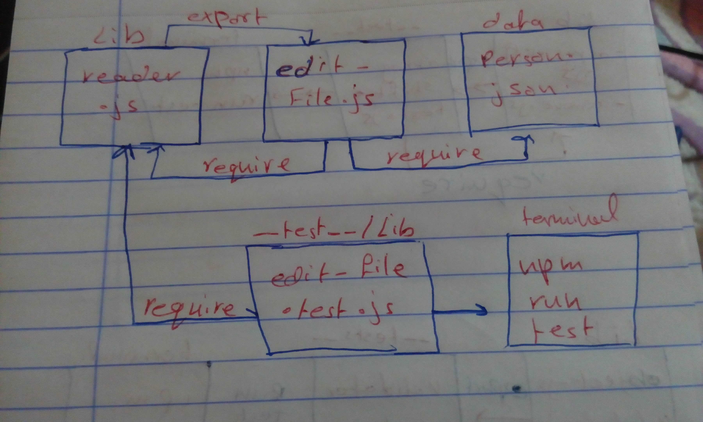

# LAB - Class 

## Async

### Author: Saja Swalgah

### Links and Resources

- [submission PR](https://github.com/Saja-401-advanced-javascript/class-03/pull/1)
- [ci/cd](http://xyz.com) (GitHub Actions)

#### How to initialize/run your application (where applicable)

-  `npm run test`

#### Tests

- How do you run tests?
   npm run test

- Describe any tests that you did not complete, skipped, etc
   I've tryed to make the writeFile part but I failed 

#### UML

